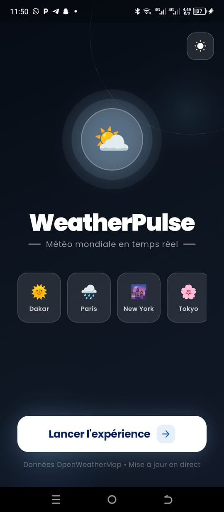
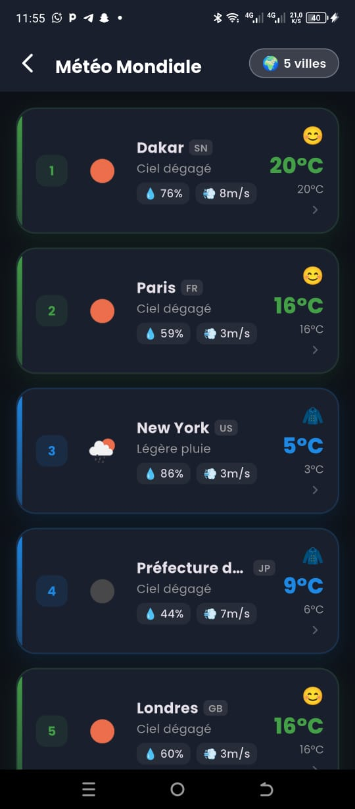
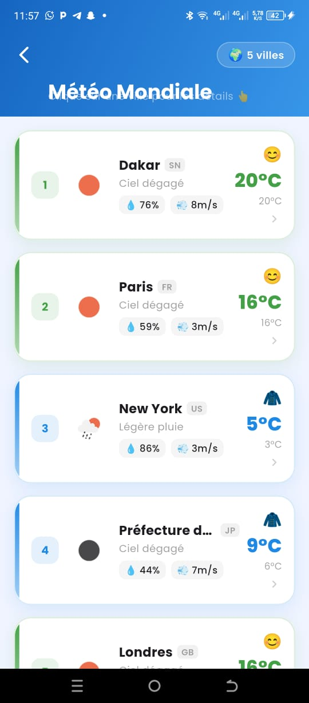
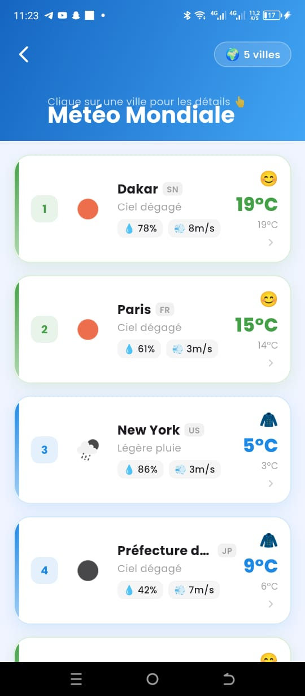
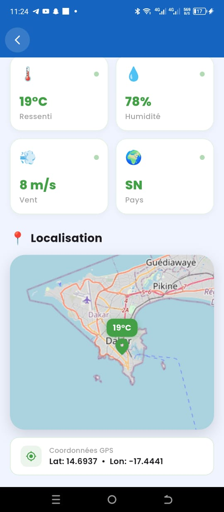
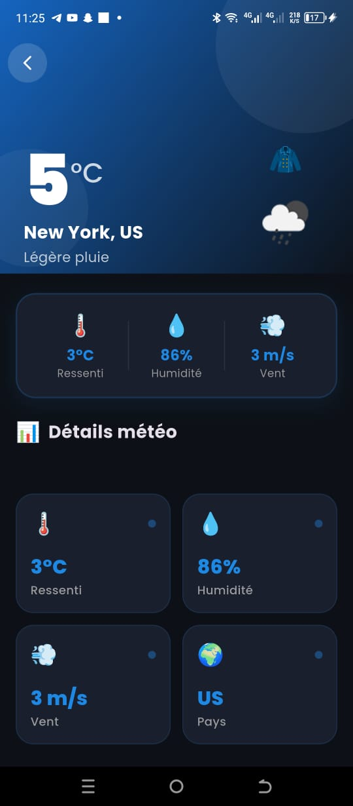
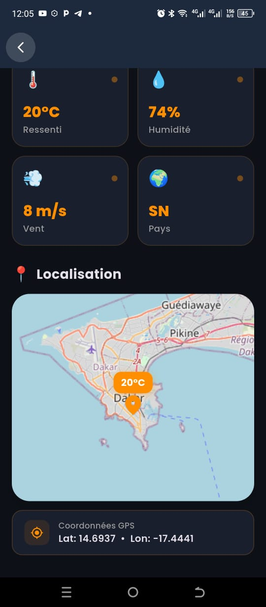

# 🌤️ WeatherPulse – Examen Développement Mobile L3GL ISI 2026


---

## 👥 Membres du Groupe

| Nom | Rôle | Branche Git |
|-----|------|-------------|
| **ADAMA SARR** | Interface principale, animations, thème | `adama-sarr` |
| **ABDOU GADIAGUA SARR** | Service météo, modèle de données, API | `abdou-gadiagua-sarr` |
| **AMINATA SOW** | Écran détail, carte, résultats, chargement | `aminata-sow` |

---

## 📱 Aperçu de l'Application

### 🏠 Écran d'accueil – Mode clair & Mode sombre

<p align="center">
  
  &nbsp;&nbsp;
  
</p>

> Interface d'accueil **WeatherPulse** avec toggle mode sombre/clair, icône météo animée et bouton "Lancer l'expérience".

---

### 📊 Écran de chargement – Jauge & Résultats prêts

<p align="center">
  
</p>

> Une fois les 5 villes chargées : **"C'est prêt ! 5 villes chargées avec succès 🌍"** avec bouton "Voir les résultats" et "Recommencer".

---

### 🌍 Écran des résultats – Météo Mondiale

<p align="center">
  
  &nbsp;&nbsp;
  
</p>

> Tableau interactif avec données météo en temps réel pour 5 villes : Dakar, Paris, New York, Tokyo, Londres. Couleurs adaptées à la température.

---

### 🗺️ Écran détail ville – Mode clair (Dakar)

<p align="center">
  
  &nbsp;&nbsp;
  
</p>

<p align="center">
  
  &nbsp;&nbsp;
  
</p>

> Détails météo complets + carte **OpenStreetMap** interactive avec marqueur de température et coordonnées GPS (Lat: 14.6937 • Lon: -17.4441).

---

### 🌙 Écran détail ville – Mode sombre (New York)

<p align="center">
  
</p>

> Même écran en mode sombre : New York, 5°C, légère pluie, humidité 86%.

---

## ✅ Fonctionnalités Implémentées

### 🏠 Écran d'accueil
- Message d'introduction animé **"WeatherPulse – Météo mondiale en temps réel"**
- Cartes des 4 villes visibles (Dakar 🇸🇳, Paris 🇫🇷, New York 🇺🇸, Tokyo 🇯🇵)
- Bouton **"Lancer l'expérience"**
- Toggle mode sombre 🌙 / clair ☀️

### 📊 Écran de chargement
- Jauge de progression animée (`CircularPercentIndicator`)
- Appels API météo en temps réel pour 5 villes
- Messages d'attente dynamiques en boucle
- **"C'est prêt ! 💥"** une fois terminé
- Boutons **"Voir les résultats"** et **"Recommencer"**
- Gestion des erreurs avec bouton "Réessayer"

### 🌍 Écran des résultats
- Tableau interactif avec données météo (température, humidité, vent)
- Emoji météo adapté à la température
- Navigation vers le détail de chaque ville

### 🗺️ Écran détail ville
- Température, ressenti, humidité, vent, pays
- Carte interactive **OpenStreetMap** avec marqueur GPS
- Coordonnées GPS affichées
- Mode sombre et clair

---

## 🛠️ Stack Technique

| Technologie | Usage |
|-------------|-------|
| **Flutter** | Framework mobile |
| **Dart** | Langage de programmation |
| **Dio** | Appels HTTP / API REST |
| **OpenWeather API** | Données météo temps réel |
| **flutter_map** + **latlong2** | Carte interactive (OpenStreetMap) |
| **provider** | Gestion d'état (thème) |
| **google_fonts** | Police Poppins |
| **percent_indicator** | Jauge de progression animée |

---

## 📂 Structure du Projet

```
lib/
├── main.dart                    # Point d'entrée, configuration thème
├── models/
│   └── weather_model.dart       # Modèle de données météo
├── providers/
│   └── theme_provider.dart      # Gestion mode sombre/clair
├── screens/
│   ├── home_screen.dart         # Écran d'accueil animé
│   ├── loading_screen.dart      # Jauge + appels API
│   ├── results_screen.dart      # Tableau des résultats
│   └── city_detail_screen.dart  # Détail ville + carte
└── services/
    └── weather_service.dart     # Service API OpenWeather (Dio)
```

---

## 🚀 Installation & Lancement

```bash
# Cloner le dépôt
git clone https://github.com/ADAMA5770/weather_app.git
cd weather_app

# Installer les dépendances
flutter pub get

# Lancer l'application
flutter run -d windows   # Windows Desktop
flutter run -d android   # Android
```

---

## 🌐 API Utilisée

- **OpenWeather API** : [openweathermap.org](https://openweathermap.org/api)
- **OpenStreetMap** via `flutter_map` (aucune clé API requise)

---

## 📸 Villes Couvertes

| # | Ville | Pays | Emoji |
|---|-------|------|-------|
| 1 | Dakar | Sénégal 🇸🇳 | ☀️ |
| 2 | Paris | France 🇫🇷 | ⛅ |
| 3 | New York | États-Unis 🇺🇸 | 🌧️ |
| 4 | Tokyo | Japon 🇯🇵 | 🌸 |
| 5 | Londres | Royaume-Uni 🇬🇧 | 🌦️ |

---

## 📋 Branches Git

| Branche | Contenu |
|---------|---------|
| `main` | Code complet du projet |
| `adama-sarr` | Interface principale, animations, thème |
| `abdou-gadiagua-sarr` | Service météo, modèle, intégration API |
| `aminata-sow` | Écrans détail, résultats, chargement, carte |

---

## ⏰ Deadline

**05 mars 2026 à 23h59m59s** – L3GL ISI 2026

---

*Développé avec ❤️ par **ADAMA SARR**, **ABDOU GADIAGUA SARR** et **AMINATA SOW***
